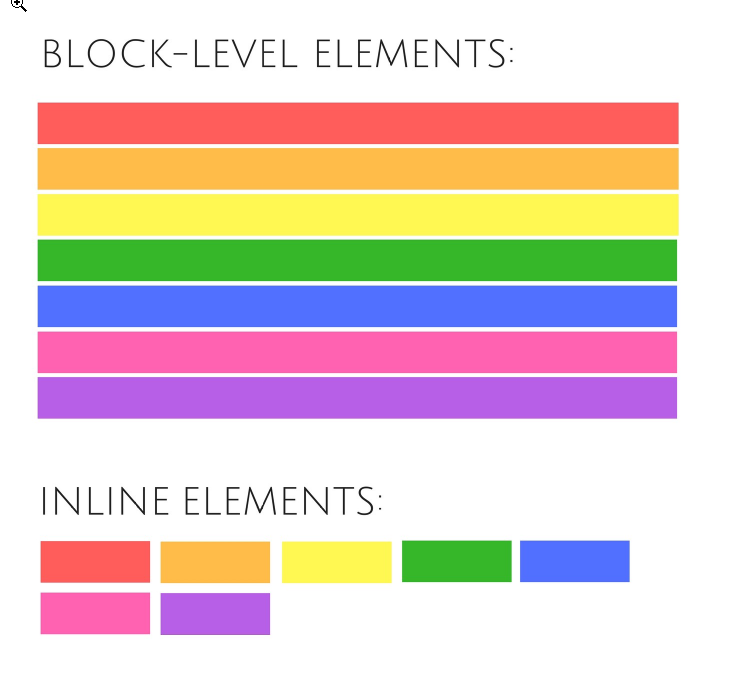

### CSS reset

- each browser is built in with some styles, to make sure we start uniformly no matter what the browser the viewer is on, we can use a CSS reset to make sure we all start on the same page when styling
- Eric Myers Reset
  https://meyerweb.com/eric/tools/css/reset/

### Box Model

- everything is a box on the web
  from inside to outside
- content , padding, border, margin

- First looks at the actual content as a guide ( width and height to constraint the size)
- overflow occurs if content size is not enough for the content provided

### Box sizing

```
*{
    box-sizing:border-box;
}
```

- selects every element and assigns it with the border-box ----------

```
html{
    box-sizing:border-box;
}
*{
    box-sizing: inherit
}
```

- current best practice.

### T R B L

- applies to padding,border,margin

```
.example{
    padding: 10px
}
.example{
    padding: 10px 20px
}
.example{
    padding: 10px 20px 10px
}
.example{
    padding: 10px 10px 10px 10px
}
```

### Vertical Margin Collapse

- only occurs in block elements ( not in flex )

### How to center things in CSS??

- if it's text or links ( or displayed as inline or inline-block ), you can use

```
.example{
    text-align: center
}
```

- if it's a block element

```
.example{
    margin: 0 auto;
}
```

### Display

- Syntax

```
.example{
    display:block
}
```



###### block

- takes the whole horizontal space if it can
- introduces a page break (line break)
- things act like a stack
- respects box model

###### inline

- takes up as much horizontal space as the content itself
- respects the horizontal aspects of the box model but not vertical

###### inline-block

- vertical-align to align inline block elements vertically
- respects both horizontal and vertical aspects of the box model
